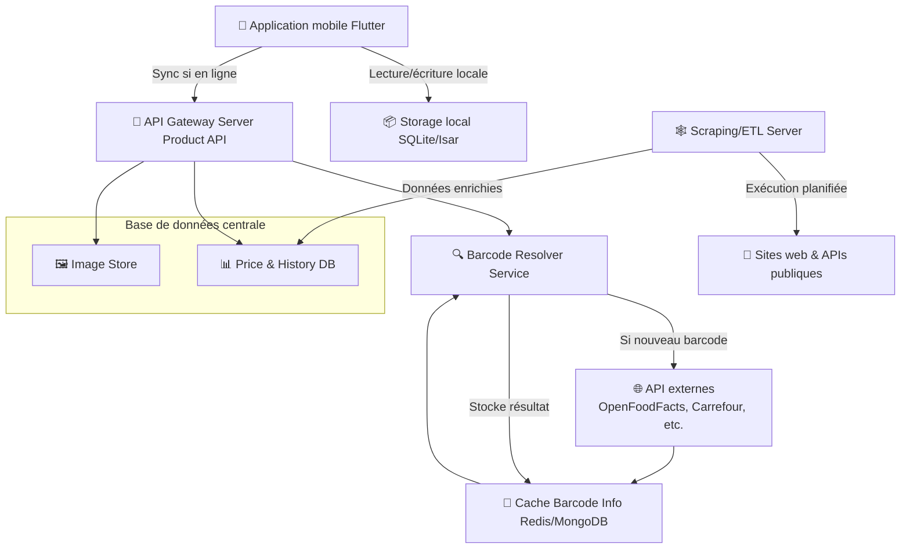

```mermaid

graph TD
    A[📱 Application mobile Flutter] -->|Lecture/écriture locale| L[📦 Storage local SQLite/Isar]
    A -->|Sync si en ligne| B[🔗 API Gateway Server Product API]
    
    B --> C1[🔍 Barcode Resolver Service]
    B --> C2[📊 Price & History DB]
    B --> C3[🖼️ Image Store]

    C1 -->|Si nouveau barcode| E1[🌐 API externes<br>OpenFoodFacts, Carrefour, etc.]
    C1 -->|Stocke résultat| D1[🧠 Cache Barcode Info Redis/MongoDB]

    E1 --> D1
    D1 --> C1

    F[🕸️ Scraping/ETL Server] -->|Exécution planifiée| E2[🛒 Sites web & APIs publiques]
    F -->|Données enrichies| C2

    subgraph Base de données centrale
        C2
        C3
    end
```
