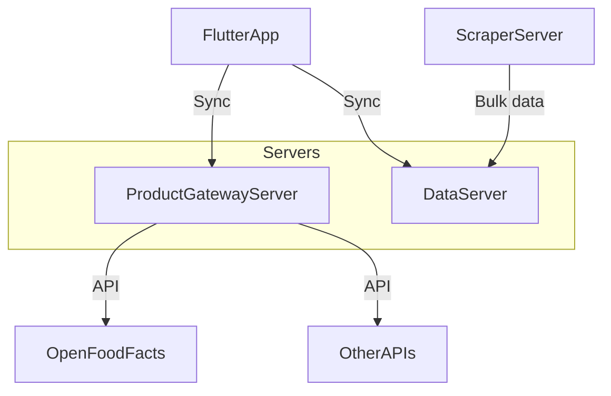

# 🛒 PrixPartout — Mobile App for Grocery Price Tracking

**PrixPartout** is a Flutter-based mobile application that helps users track and compare product prices across different supermarkets. The app is designed to work **offline-first** for fast in-store usage and can **synchronize** with external servers for enhanced insights, statistics, and product information.

---

## 🚀 Purpose

- Enable **fast product scanning** in stores (barcode + price + optional photo in under 5 seconds)
- Allow **offline data collection**, syncing asynchronously when needed
- Let users track **price evolution per product and category**
- Identify **cheaper stores** over time
- Reduce dependency on external APIs via caching and background scraping

---

## 🧱 Project Structure
```
your-app/
├── apps/ # Flutter mobile client & Dart backend servers
├── packages/ # Shared Dart packages (models, contracts, utils)
├── scrapers/ # Python scraping scripts
├── devops/ # Docker & infrastructure config
├── docs/ # Diagrams & technical documentation
└── README.md
```


---

## 🧩 Core Components

| Component           | Description                                                              |
|---------------------|--------------------------------------------------------------------------|
| **Flutter Client**  | Offline-first mobile app with syncing capabilities                       |
| **Gateway Server**  | Barcode-to-product API using OpenFoodFacts or commercial APIs            |
| **Data Server**     | Stores price history, syncs with clients, computes analytics             |
| **Scraper Server**  | Periodically fetches prices via web scraping or supermarket APIs         |
| **Shared Packages** | Common Dart models, validation tools, and HTTP API contracts             |

---

## 🔄 System Overview



# 🔐 Security & Performance
Offline storage with SQLite or Isar

External API caching layer to reduce costs and latency

Authentication planned via simple tokens (expandable to OAuth)

All heavy logic (statistics, ML, image classification) done on the server

| Client (Mobile)         | Backend Servers            | Scraping Tools         |
| ----------------------- | -------------------------- | ---------------------- |
| Flutter + Dart          | Dart (shelf / Frog)        | Python + requests/bs4  |
| BarcodeScan / Camera    | PostgreSQL or MongoDB      | JSON/CSV to DB         |
| SQLite / Isar (offline) | REST API (local or Docker) | Cron / scheduled tasks |
---
