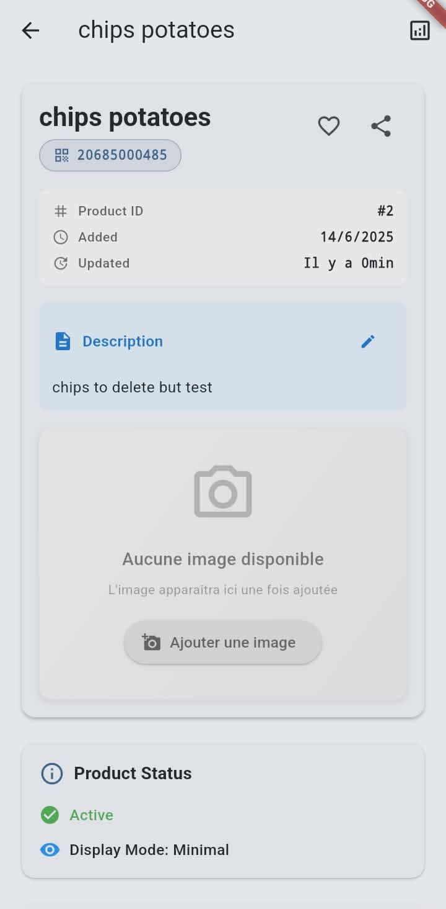
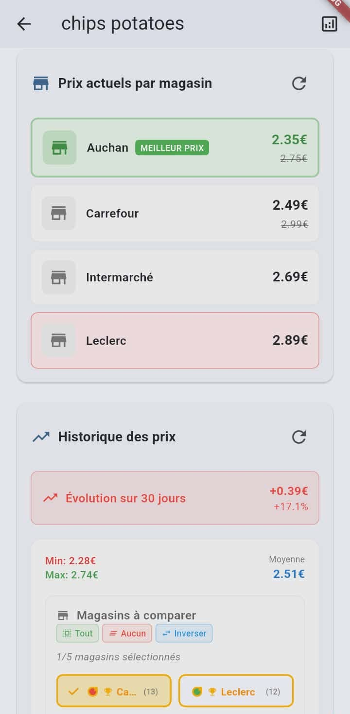
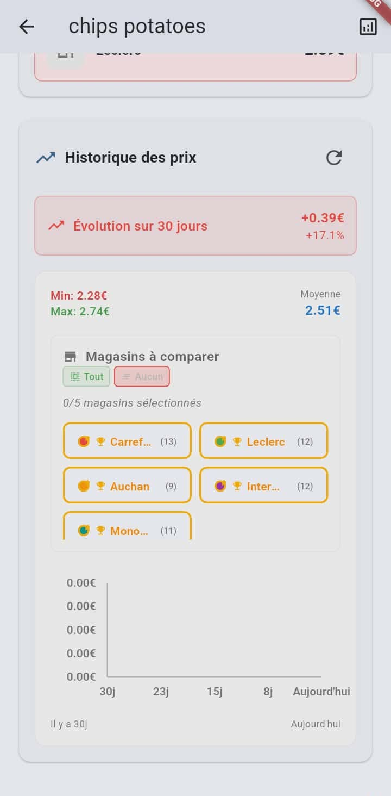
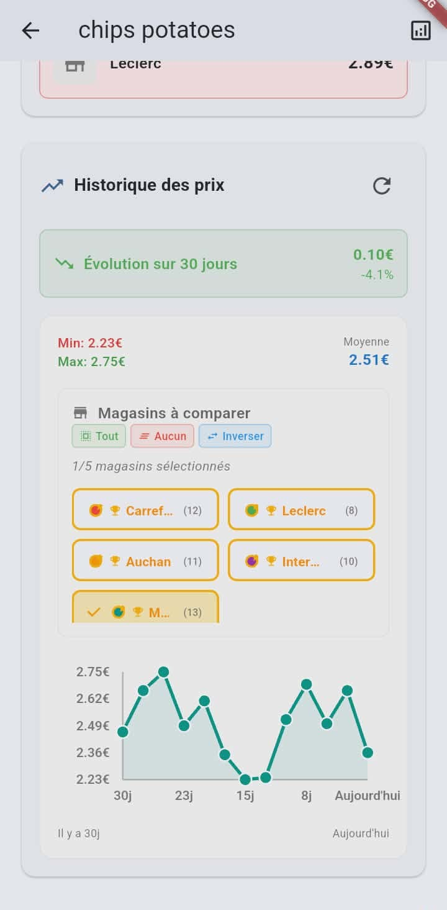
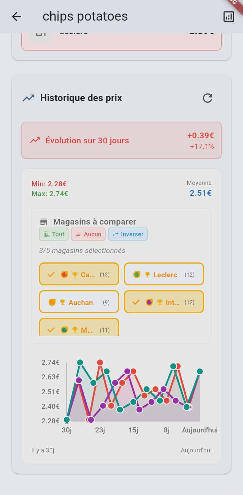
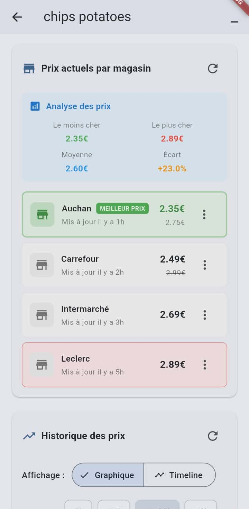
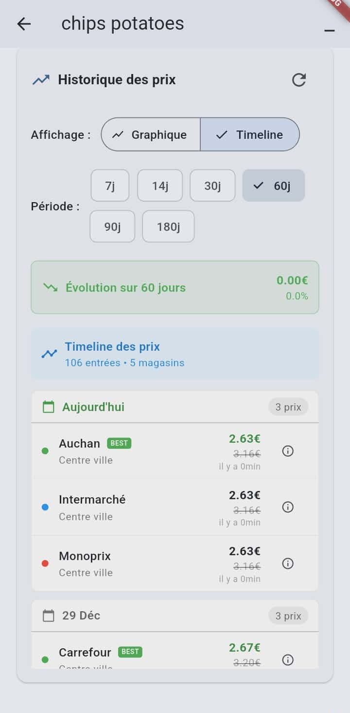
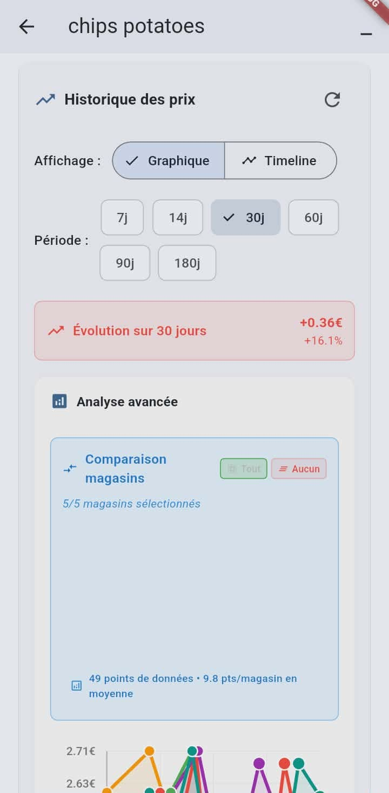
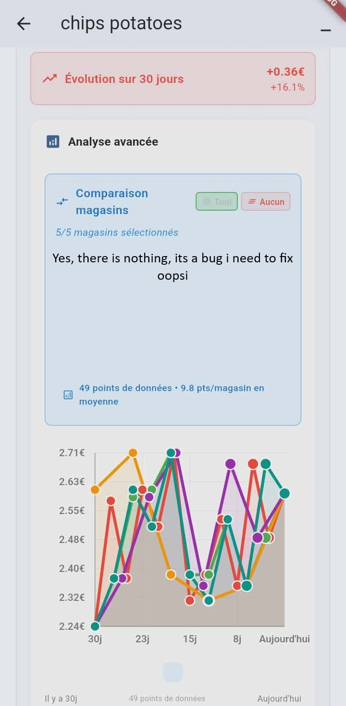

Table of Contents
==================
- [Table of Contents](#table-of-contents)
- [Milestone Log — 2025-12-31](#milestone-log--2025-12-31)
  - [Summary](#summary)
  - [Setup](#setup)
  - [Client](#client)
  - [Data Server](#data-server)
  - [Tests](#tests)
  - [Devops / Melos scripts](#devops--melos-scripts)
  - [Tools](#tools)
  - [Cleanup / Security](#cleanup--security)
  - [Notes / Next steps](#notes--next-steps)

# Milestone Log — 2025-12-31

## Summary
A set of low-risk, high-value changes to improve local dev ergonomics and runtime configurability. Focus areas: centralizing server configuration, safe defaults and fallbacks, debug UI, tests, build/test automation, and developer helper scripts.

---

## Setup
- Added `tools/setup_env.py` (Python) — interactive helper that creates `apps/client/.env` from `apps/client/.env.example` or prompts for values when missing.
- Added `tools/setup_dev.bat` — Windows convenience wrapper that runs the environment setup script and `melos run get`.
- Added `apps/client/.env.example` and updated `apps/client/.gitignore` to ignore the real `.env`.

## Client
- Introduced an injectable `ConfigService` that provides centralized access to the server IP/port and `baseUrl`:
  - Persists overrides using `SharedPreferences` (methods: `setIpPort`, `clearOverride`).
  - Loads defaults from `.env` when present (via `flutter_dotenv` load, with manual fallback parsing) and falls back to `localhost:8080` otherwise.
  - Exposes `baseUrl` and simple getters (`ip`, `port`).
- Integrated `ConfigService` into startup flow:
  - `AppInitializationService` now initializes `ConfigService` during app initialization and exposes it via `configService`.
  - The `configService` getter performs lazy initialization to avoid early construction race conditions.
- Network services updated to use `ConfigService` (injected or obtained from `AppInitializationService`):
  - `ClientServerService` and `ProductDetailsService` now resolve their server URL through `ConfigService` (safe fallback to `http://localhost:8080`).
  - Services are resilient to early access (no hard exceptions when `ConfigService` not initialized).
- Debug UI improvements:
  - `pages/debug/debug_page.dart` contains a small Server Configuration panel (IP + Port fields) in the Advanced menu to change and persist the server address at runtime.
  - Added buttons to Save, Clear, and Test the configured server directly from the app.
- Error handling:
  - `ConfigService.init()` raises a clear `ConfigException` if `.env` exists but fails to parse / load (so failures are explicit instead of silently ignored).
  - App initialization uses graceful fallbacks and logs warnings when appropriate.

## Data Server
- Restored/Repaired server entrypoints so `melos run dev:server` reliably runs the server:
  - `apps/data_server/lib/main.dart` contains the server startup logic.
  - `apps/data_server/bin/main.dart` acts as a thin wrapper delegating to the package main for `dart run lib/main.dart` compatibility.

## Tests
- Added unit tests for `ConfigService` in `apps/client/test/services/config_service_test.dart`:
  - Validate defaults and baseUrl computation
  - Validate persistence via `SharedPreferences` mock
  - Validate reading `.env` values via injected env overrides in tests
- Exposed a testing-friendly getter in `ClientServerService` (`testableBaseUrl`) to facilitate assertions in unit tests.

## Devops / Melos scripts
- Updated `melos.yaml` with new convenience commands:
  - `test:packages`, `test:apps`, `test:all` — run unit tests across workspace
  - `build:all-and-test` — build everything then run tests
  - `dev:server` / `dev:client` — explicit scripts to run server and client in foreground
  - `dev:all` — orchestrates build/test + runs client (notes server must be started separately)
- Avoided unreliable cross-platform background server-start hacks; prefer explicit foreground runs for reliability and logs.

## Tools
- Added `tools/setup_env.py` and `tools/setup_dev.bat` to ease local `.env` creation and developer onboarding.
- Added guidance to `README.md` documenting `.env` usage and setup steps.

## Cleanup / Security
- Replaced hard-coded private IP defaults with neutral `localhost:8080` default.
- Added `.env.example` and ignored local `.env` to avoid leaking internal network details in the repository.

## Notes / Next steps
- Optional improvements to consider:
  - Add a small CI job to run `melos run build:all-and-test` on PRs (I can add a GitHub Actions template).
  - Add an automatic provisioning option (QR scan, mDNS/UDP discovery) to avoid manual config in larger labs.
  - Add a dev helper to start server in background reliably with PID/log management (if you want background start again).
  - Add integration tests for `.env` file parsing and startup error reporting.

---

Current App flow 
First, scan a product barcode:

You arrive to the Minimal View showing basic product info and price comparisons:

if you scroll down, you can see more details:

You can see the view of the product without stores:

Or with one store:

Or with multiple stores:

Then the advanced view shows more details about the product:

You can scroll down to see more details. See the timeline of price changes:

Or see the graph of price changes: you can retrieve data from multiples timelines and choose how to display them.

This is the full graph view:

Enjoy!